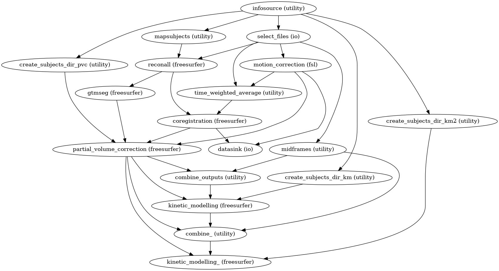

# Running BIDS datasets though PetSurfer

BrainHack Nordic 2022/12/07
- https://github.com/pwighton/fs-docker/blob/master/notes/20221205-petsurfer-brainhack-global.md

## Follow Along

To follow along on your machine, you'll need some data and a FreeSurfer env.

### Setup a FreeSurfer env

There are several ways to get a FreeSurfer env

**1) BrainHack Cloud**
- https://bhnam.neurodesk.org/
- https://bheurope.neurodesk.org/
- https://bhsydney.neurodesk.org/
- Authenticate via github to get a [neurodesk](https://www.neurodesk.org/) env with
  - 32CPUs
  - 256GB RAM
  - 500GB of scratch
- `module load freesurfer` in a terminal window to activate freesurfer env
- Use neurodesktop icon to run FreeView!
- Thanks to [stebo85](https://github.com/stebo85) :heart:

**2) Downalod and Install**
- https://surfer.nmr.mgh.harvard.edu/fswiki/rel7downloads
- Make a directory for subject data
- `SUBJECTS export_DIR=/home/my/freesurfer-subjects-dir`
- `export FREESURFER_HOME=/home/my/freesurfer-dir`
- `source $FREESURFER_HOME/SetUpFreeSurfer.sh`

**3) Downlod a Virtual Machine**
- And run it in virtualbox
- [Instructions](https://surfer.nmr.mgh.harvard.edu/fswiki/VM_67)

### Get some data:

```
wget 'https://drive.google.com/u/3/uc?id=1_2lMBBRfw4RU8Hiw9WQKbynhN7IsMV0w&export=download&confirm=yes' \
  -O ds001421.tar.gz
tar -zxvf ./ds001421.tar.gz
```

This is [OpenNeuro's ds001421 dataset](https://openneuro.org/datasets/ds001421/versions/1.0.1) as processed by `pwighton/petsurfer-bids:7.2.0` as follows (in bash):

```
export CONTAINER_NAME=pwighton/petsurfer-bids:7.2.0
export BASEDIR=/home/ec2-user/environment/ds001421__petsurfer-bids_7.2.0
export FS_LICENSE_FILE=/home/ec2-user/license.txt
export DATASET_S3_URI=s3://openneuro.org/ds001421

mkdir -p ${BASEDIR}
cd ${BASEDIR}
aws s3 sync ${DATASET_S3_URI} ./${DATASET_NAME}
docker pull ${CONTAINER_NAME}

docker run -it --rm \
  -u $(id -u):$(id -g) \
  -v $BASEDIR:$BASEDIR \
  -v $FS_LICENSE_FILE:/license.txt:ro \
  -e FS_LICENSE='/license.txt' \
  ${CONTAINER_NAME} \
    /opt/petpipeline/petpipeline/main.py \
      -c /opt/petpipeline/petpipeline/config.yaml \
      -e ${BASEDIR} \
      -o output \
      -w temp \
      -d ${BASEDIR}/${DATASET_NAME}
```

You can get a `license.txt file` for FreeSurfer [here](https://surfer.nmr.mgh.harvard.edu/registration.html)

The container `pwighton/petsurfer-bids:7.2.0` was created using [this Dockerfile](https://github.com/pwighton/fs-docker/blob/master/petsurfer-bids/dockerfile) which installes this [nipype pipeline](https://github.com/openneuropet/PET_pipelines/tree/main/pet_nipype).  The parent container of `pwighton/petsurfer-bids:7.2.0` is `pwighton/petsurfer:7.2.0` which was created with the following [neurodocker](https://github.com/ReproNim/neurodocker) command:

```
docker run pwighton/neurodocker:20220822 generate docker \
    --yes \
    --base-image python:3.8-buster \
    --pkg-manager apt \
    --fsl \
      version=5.0.10 \
      method=binaries \
    --freesurfer \
      version=7.2.0 \
    | docker build -t pwighton/petsurfer:7.2.0 -
```

## Exploring the data

```
tree -d -L 2
```

Gives
```
.
├── derivatives
│   ├── coregistration
│   ├── km
│   ├── km2
│   ├── motion_correction
│   └── pvc
├── ds001421_openneuro.org
│   ├── derivatives
│   └── sub-01
├── freesurfer
│   ├── baseline_01
│   └── rescan_01
└── temp
    └── preprocessing
```

- `./derivatives` are the outputs of the pipeline
- `./ds001421_openneuro.org` is the data as downloaded from openneuro
  - `./ds001421_openneuro.org/derivatives` is not used
- `./freesurfer` is the FreeSurfer subject's directory
- `./temp` are nipype working directories
  - See `./temp/preprocessing/graph.png` for the nipype DAG

### Cautionary note about image file formats 

The file extensions `nii`, `nii.gz`, `mgh`, `mgz` are traditionally 3d imaging formats and that is sometimes case the across this dataset, but it is also used as intermediate and output files for ROI-based analysis so that they can be performed with [`mri_glmfit`](https://surfer.nmr.mgh.harvard.edu/fswiki/mri_glmfit).  These files have voxel dimensions of `N x 1 x 1 x M` and are not viewable in traditional viewers.  Use `mri_info --dim filename` to identify these files.

These files can be converted to a numpy array via:

```
import nibabel as nb
 
filename='gtm.nii.gz'
gtm_nb = nb.load(filename)
gtm = gtm_nb.get_fdata().squeeze()
```

## Viewing the DAG

See `./temp/preprocessing/graph.png` for the nipype DAG



## Customizing the pipeline

See [`config.yaml`](https://github.com/openneuropet/PET_pipelines/blob/main/pet_nipype/petpipeline/config.yaml)

- `environment` vars get overidded on the command line (most other params should too, tbh)
- [`motion_correction`](https://github.com/openneuropet/PET_pipelines/blob/f77ffdb147e669bd641d32d00c98fbf6800a4185/pet_nipype/petpipeline/PETPipeline.py#L94) vars are passed to FSL's [mcflirt](https://fsl.fmrib.ox.ac.uk/fsl/fslwiki/MCFLIRT)
  - [The mcflirt input interface in nipype](https://github.com/nipy/nipype/blob/c3020e271785cfd31148eeb322eeb369baa12137/nipype/interfaces/fsl/preprocess.py#L804) 
- [`coregistration`](https://github.com/openneuropet/PET_pipelines/blob/f77ffdb147e669bd641d32d00c98fbf6800a4185/pet_nipype/petpipeline/PETPipeline.py#L108) vars are passed to [mricoreg](https://surfer.nmr.mgh.harvard.edu/fswiki/mri_coreg)
  - [The mricoreg interface in nipype](https://github.com/nipy/nipype/blob/c3020e271785cfd31148eeb322eeb369baa12137/nipype/interfaces/freesurfer/registration.py#L399)
- `reconall` run's freesurfer's [recon-all](https://surfer.nmr.mgh.harvard.edu/fswiki/ReconAllDevTable) stream
- [`partial_volume_correction`](https://github.com/openneuropet/PET_pipelines/blob/f77ffdb147e669bd641d32d00c98fbf6800a4185/pet_nipype/petpipeline/PETPipeline.py#L138) vars are passed to [mri_gtmpvc](https://surfer.nmr.mgh.harvard.edu/fswiki/PetSurfer)
  - [The mri_gtmpvc interface in nipype](https://github.com/nipy/nipype/blob/master/nipype/interfaces/freesurfer/petsurfer.py) 
  - Numbers in `km_ref` and `km_hb` refer to labels in [FreeSurfer's Lookup table](https://github.com/freesurfer/freesurfer/blob/dev/distribution/FreeSurferColorLUT.txt)

## Viewing some data

In MRI space:
```
freeview \
  --volume  ./freesurfer/baseline_01/mri/orig.mgz \
  --volume  ./freesurfer/baseline_01/mri/aseg.mgz:colormap=lut \
  --surface ./freesurfer/baseline_01/surf/lh.white \
  --surface ./freesurfer/baseline_01/surf/rh.white \
  --surface ./freesurfer/baseline_01/surf/lh.pial \
  --surface ./freesurfer/baseline_01/surf/rh.pial
```

In PET space:
```
freeview \
  --volume ./ds001421_openneuro.org/sub-01/ses-baseline/pet/sub-01_ses-baseline_pet.nii.gz \
  --volume ./derivatives/pvc/sub-01/ses-baseline/aux/seg.nii.gz:colormap=lut
```

## Playing with surfaces

Extract a single frame (frame #25) from the multi-frame pet data:
```
mri_convert -nth 25 \
  ./ds001421_openneuro.org/sub-01/ses-baseline/pet/sub-01_ses-baseline_pet.nii.gz \
  ./ds001421_openneuro.org/sub-01/ses-baseline/pet/sub-01_ses-baseline_pet--frame25.nii.gz
```

Project a frame onto the surface:
```
export SUBJECTS_DIR=/home/paul/lcn/20221130-petsurfer-bids-processed-datasets/ds001421/freesurfer
mri_vol2surf \
  --mov ./ds001421_openneuro.org/sub-01/ses-baseline/pet/sub-01_ses-baseline_pet--frame25.nii.gz \
  --reg ./derivatives/coregistration/sub-01/ses-baseline/registration.lta \
  --hemi lh \
  --projfrac 0.5 \
  --o ./freesurfer/baseline_01/surf/sub-01--ses-baseline--lh.pet.fsaverage.sm00.frame25.nii.gz \
  --cortex \
  --trgsubject baseline_01
```

Visualize
```
freeview \
  --volume ./freesurfer/baseline_01/mri/orig.mgz \
  --surface ./freesurfer/baseline_01/surf/lh.white:overlay=./freesurfer/baseline_01/surf/sub-01--ses-baseline--lh.pet.fsaverage.sm00.nii.gz \
  --surface ./freesurfer/baseline_01/surf/lh.inflated:overlay=./freesurfer/baseline_01/surf/sub-01--ses-baseline--lh.pet.fsaverage.sm00.nii.gz
```

More details [here](https://surfer.nmr.mgh.harvard.edu/fswiki/PetSurfer#Surface-basedanalysis)

## Resources

- [Petsurfer Wiki Page](https://surfer.nmr.mgh.harvard.edu/fswiki/PetSurfer)
- [PetSrufer Tutorial](https://surfer.nmr.mgh.harvard.edu/fswiki/PetSurferKmTutorial)
- [PetSurfer Talk by Doug at last year’s BrainHack](https://youtu.be/1-sgAct6_NY?t=1583)
- [FreeSurfer Mailing List](http://mail.nmr.mgh.harvard.edu/mailman/listinfo/freesurfer)
- [FreeSurfer License Keys](https://surfer.nmr.mgh.harvard.edu/registration.html)

## Next Steps

- Should more of `config.yaml` be exposed to the command line?
- Does it make sense to collect config files for various openneuro repos?
- What would the `config.yaml` be for [ds001705](https://openneuro.org/datasets/ds001705/versions/1.0.1)?
- What does full reproducibility of `docker build` look like?
- What does a voxel-based PET analysis look like?
